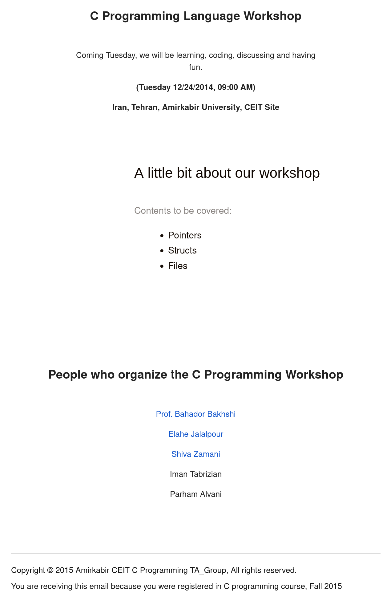

# TBMap


## Introduction

This repository was created in C programming workshop of Introduction to Programming Course Fall 2015.
[Bitmap](https://en.wikipedia.org/wiki/BMP_file_format) is a simple image format and we use it in order to demostrate working with files and structs in C.

## Acknowledgements

I want to thank every single person who contributed to that awesome workshop which created the basis for this project:

- [Dr.Bakhshi](https://github.com/Bahador-Bakhshi)
- [Elahe Jalalpour](https://github.com/eljalalpour)
- [Shiva Zamani](https://github.com/shiva-z)
- [Iman Tabrizian](https://github.com/tabrizian)

## How to run?

This is a cmake-based project so you can build and run it as follow:

```sh
cmake --build .
./bin/TBMap.out
```

## The Invitation

We had sent the following invitation on Fall 2015 to all C course students.
The invitation date was wrong and it should be 24 Dev 2015 not 2014.


